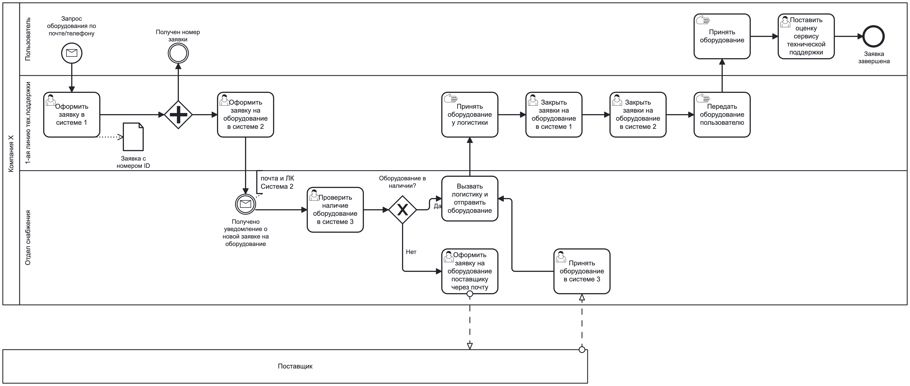
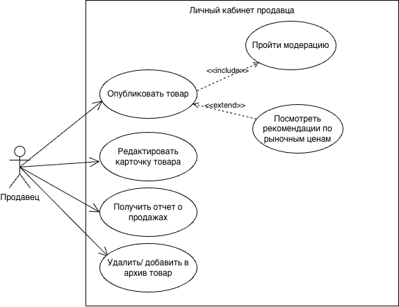

# Test-task
Решение тестового задания на позицию Junior Fullstack-аналитик.
# Задача 1
  
Анализ процесса AS-IS "Выдача IT-оборудования пользователям по заявке" и рекомендации по оптимизации "TO-BE".
## Уточняющие вопросы:
- Пользователь выбирает оборудование из фиксированного списка?
- Каким образом передается пользователю уведомление с номером заявки? В какой системе пользователь отслеживает статус заявки?
- Что происходит, если оборудование отстутствует и на складе и у поставщика?
- Сколько времени отдел снабжения ожидает поставку оборудования?
## Проблемы:
- Отсутствие единого контура, все системы (1, 2, 3) не интегрированы друг с другом;
- Ручной перенос данных из одной системы в другую, риск потери данных;
- Информационный разрыв (если пользователь отслеживает статус заявки в системе 1, а отдел снабжения заказывает оборудование в системе 3, у пользователя статус заявки не меняется);
- Неэффектиность 1-ой линии технической поддержки, сотрудники вручную вводят данные сначала в систему 1, затем в систему 2. 
## Рекомендации:
- Создание новой единой платформы для заказа оборудования, сообщения между пользователем, отделом снабжения и логистикой, учета реальных остатков на складе, записи/пополнения новых позиций;
- Исключение 1-ой линии технической поддержки с целью сокращения затрат на содержания отдела, минимизации риска потери данных и исключения ручного ввода.
# Задача 2
Разработка требований к Личному кабинету продавца для публикации товара на витрине маркетплейса.
## User story
- Я как продавец хочу иметь возможность опубликовать товар на витрине, чтобы начать продажи.
- Я как продавец хочу иметь возможность редактировать карточку товара, чтобы улучшить публикацию.
- Я как продавец хочу иметь возможность продвигать товар (реклама, выделение в топе), чтобы увеличить объем продаж.
- Я как продавец хочу получать рекомендации по рыночной ценой, чтобы повысить конкурентоспособность и эффективность продаж.
- Я как продавец хочу иметь возможность удалять или переносить в архив карточки товаров, чтобы поддерживать актуальный ассортимент товаров.
- Я как продавец хочу видеть остатки товара на складе, чтобы своевременно планировать поставки и закупки.
- Я как продавец хочу видеть отчет о продажах, чтобы анализировать прибыльность продаж.
## Use case
|Название|UC-01 Публикация товара на витрине маркетплейса|
|:---|:---|
|**Актор**|Продавец|
|**Предусловаия**|Продавец зарегистрирован, вся юридическая и платежная информация заполнена|
|**Основной поток**|1. Продавец нажимает кнопку "Разместить товар на витрине"   2. Продавец выбирает из выпадающего списка категорию товара/ подкатегорию товара   3.Продавец заполняет описание товара, цену и количество единиц товара   4. Продавец загружает фотографии товара   5. Продавец нажимает кнопку "Опубликовать товар"   6.Система проверяет объявление и присваивает статус "На модерации"   7.Система публикует после модерации карточку на витрине и присваивает статус "Активно"|
|**Альтернативные сценарии**|А1. Если не все поля заполнены, кнопка "Опубликовать товар" не активна   А2. Если цена товара меньше 0, система высвечивает сообщение о некорректности введенных данных   А3. Если формат изображений не соответствует или объем превышает максимально допустимый, система высвечивает предупреждающее сообщение   А4. Система возвращает карточку товара на доработку, если контент (фотографии/текст) не соответствуют требованиям законодательства или оферты площадки |
|**Негативные сценарии**| Если в момент нажатия кнопки "Опубликовать товар" произошел сбой на сервере, система высвечивает сообщение о технической ошибке и сохраняет объявление в черновиках в Базе данных |

# Задача 3.1
URL: api/v1/auth/register
Method: POST
Request Body:
{
"firstName": "string",
"lastName": "string",
"userName": "string",
"password": "string",
"captcha": "string"
}

